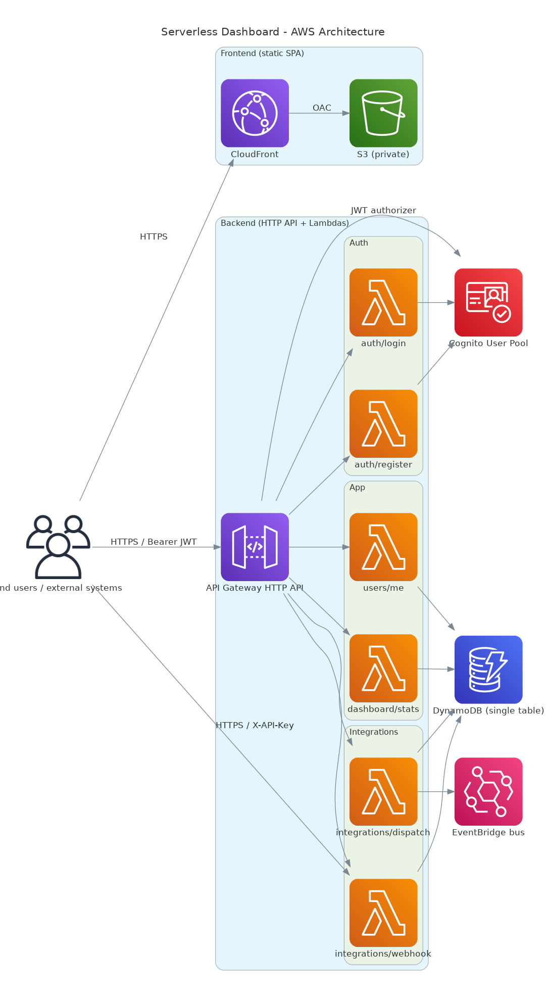

# serverless-dashboard-aws

Aplicação **100% serverless** na AWS com:

- Frontend SPA em **React + Vite + TypeScript** servido por **CloudFront + S3**
- API em **API Gateway HTTP API** + **AWS Lambda (Python 3.12)**
- Autenticação via **Amazon Cognito User Pool** (JWT)
- Persistência em **DynamoDB** (single-table design)
- Fan-out de integrações sistêmicas via **EventBridge**
- IaC com **Serverless Framework v3**
- CI no **GitHub Actions** (lint + testes + build + validação do `serverless.yml`)

A arquitetura completa está documentada em [`docs/architecture.md`](./docs/architecture.md)
com diagrama PNG e diagramas de sequência em Mermaid.



## Estrutura do repositório

```
.
├── backend/                Lambdas Python + IaC + testes (pytest, moto)
│   ├── pyproject.toml      Dependências do projeto Python
│   ├── requirements.txt    Dependências de runtime empacotadas pelo serverless-python-requirements
│   ├── package.json        serverless + plugin de python requirements
│   ├── serverless.yml      Cognito + API + Lambdas + DynamoDB + S3 + CloudFront + EventBridge
│   ├── handlers/           Um arquivo por endpoint (auth, users, dashboard, integrations)
│   ├── lib/                Helpers de DynamoDB, autenticação, respostas, logging
│   └── tests/              Testes pytest com mocks via moto
├── frontend/               SPA React + Vite + TypeScript
│   ├── src/
│   │   ├── pages/          Login, Register, Dashboard
│   │   ├── auth/           Contexto de autenticação
│   │   ├── api/            Cliente HTTP tipado
│   │   └── components/     Layout, PrivateRoute
│   └── package.json
├── docs/
│   ├── architecture.md     Documentação detalhada
│   ├── architecture-diagram.py  Script para gerar o PNG (lib `diagrams`)
│   └── architecture-diagram.png Diagrama gerado
└── .github/workflows/ci.yml
```

## Endpoints

| Método | Path | Auth | Descrição |
|---|---|---|---|
| POST | `/auth/register` | público | Cadastro do usuário no Cognito + perfil no DynamoDB |
| POST | `/auth/login` | público | Devolve `idToken`/`accessToken`/`refreshToken` |
| GET  | `/users/me` | JWT | Perfil do usuário autenticado |
| GET  | `/dashboard/stats` | JWT | Métricas agregadas dos eventos do usuário |
| POST | `/integrations/webhook` | `X-API-Key` | Recebe eventos de sistemas externos |
| POST | `/integrations/dispatch` | JWT | Publica evento na EventBridge custom bus |

## Pré-requisitos para deploy

- Conta AWS com permissões para criar Cognito, API Gateway, Lambda, DynamoDB, S3, CloudFront e EventBridge
- AWS CLI configurada (`aws configure`) ou credenciais via `AWS_ACCESS_KEY_ID` / `AWS_SECRET_ACCESS_KEY`
- Node.js 20+
- Python 3.12+
- Docker (recomendado para `serverless-python-requirements`, opcional)

## Setup local

### Backend

```bash
cd backend
python -m venv .venv
source .venv/bin/activate
pip install -e ".[dev]"

# Lint + testes
ruff check handlers lib tests
pytest
```

### Frontend

```bash
cd frontend
cp .env.example .env  # ajuste VITE_API_BASE_URL
npm install
npm run lint
npm run typecheck
npm run dev   # http://localhost:5173
```

### Serverless Framework (npm)

O `serverless.yml` e o plugin `serverless-python-requirements` ficam dentro de `backend/`
(o plugin precisa do `requirements.txt` ao lado do `serverless.yml` para empacotar as deps).

```bash
cd backend
npm install
cp .env.example .env  # defina WEBHOOK_API_KEY
```

## Deploy completo

```bash
# 1. Backend + recursos AWS (rodar de dentro de backend/)
cd backend
npx serverless deploy --stage dev

# Pegue os outputs (HttpApiUrl, UserPoolId, UserPoolClientId, FrontendBucketName, FrontendDistributionDomain)
npx serverless info --stage dev

# 2. Frontend
cd ../frontend
echo "VITE_API_BASE_URL=https://<HttpApiUrl-do-output>" > .env.production
npm install
npm run build

# 3. Upload do bundle e invalidação de cache
aws s3 sync dist/ "s3://<FrontendBucketName>/" --delete
aws cloudfront create-invalidation \
    --distribution-id <DistributionId> --paths "/*"
```

A SPA fica disponível em `https://<FrontendDistributionDomain>`.

## Deploy automático em push para `prod`

O workflow [`.github/workflows/deploy.yml`](.github/workflows/deploy.yml)
faz `serverless deploy`, build do frontend, `aws s3 sync` para o bucket e
invalidação do CloudFront a cada push na branch `prod` (ou via
`workflow_dispatch`). Autenticação na AWS é feita por **OIDC**, sem
guardar `AWS_ACCESS_KEY_ID`/`AWS_SECRET_ACCESS_KEY` em segredo do GitHub.

### 1. Bootstrap one-time da confiança AWS ↔ GitHub

A stack [`bootstrap/github-oidc.yml`](./bootstrap/github-oidc.yml) cria o
provedor OIDC e uma role IAM com `sts:AssumeRoleWithWebIdentity` restrito
ao seu repo + branch.

```bash
aws cloudformation deploy \
  --stack-name serverless-dashboard-github-oidc \
  --template-file bootstrap/github-oidc.yml \
  --capabilities CAPABILITY_NAMED_IAM \
  --parameter-overrides \
      GitHubOrg=andysilva86 \
      RepoName=serverless-dashboard-aws \
      DeployBranch=prod
# Se sua conta já tem o OIDC provider para token.actions.githubusercontent.com,
# adicione: CreateOIDCProvider=false
```

Pegue o `DeployRoleArn` do output:

```bash
aws cloudformation describe-stacks \
  --stack-name serverless-dashboard-github-oidc \
  --query "Stacks[0].Outputs[?OutputKey=='DeployRoleArn'].OutputValue" \
  --output text
```

### 2. Configure o repositório no GitHub

Em **Settings → Secrets and variables → Actions** crie:

| Tipo | Nome | Valor |
| --- | --- | --- |
| Secret | `AWS_DEPLOY_ROLE_ARN` | ARN do output acima |
| Secret | `WEBHOOK_API_KEY` | string forte (use `openssl rand -hex 32`) |
| Variable (opcional) | `AWS_REGION` | região da deploy (default `us-east-1`) |

> Recomendado: criar um **Environment** chamado `prod` em **Settings → Environments**
> e exigir aprovação manual antes do deploy. O workflow já está configurado com
> `environment: prod`, então as protections (required reviewers, wait timer,
> deployment branches) entram automaticamente.

### 3. Deploy

```bash
git checkout -b prod
git push -u origin prod
```

Cada push subsequente para `prod` re-deploya backend + frontend. Para
fazer um deploy manual de qualquer branch, use **Actions → Deploy to AWS
→ Run workflow**.

### Confirmar usuário criado pela tela de cadastro

O Cognito User Pool é criado com `AutoVerifiedAttributes: email`, mas o e-mail
de verificação só será enviado se você configurar SES. Para testar rapidamente,
confirme o usuário via CLI:

```bash
aws cognito-idp admin-confirm-sign-up \
  --user-pool-id <UserPoolId> \
  --username <email>
```

## Testes locais do webhook

```bash
curl -X POST "<HttpApiUrl>/integrations/webhook" \
  -H "Content-Type: application/json" \
  -H "X-API-Key: $WEBHOOK_API_KEY" \
  -d '{"userSub":"<sub>","eventType":"page_view","data":{"path":"/home"}}'
```

## Remover stack

```bash
cd backend
npx serverless remove --stage dev
```

> CloudFront pode levar 15-20 minutos para excluir. Antes de rodar `remove`, esvazie o
> bucket de frontend (`aws s3 rm s3://<FrontendBucketName>/ --recursive`).

## Decisões de arquitetura (TL;DR)

- **HTTP API** ao invés de REST API — 70% mais barato e suporta JWT authorizer nativo.
- **Single-table DynamoDB** com PK/SK + GSI1 — uma tabela atende perfis, eventos e listagens cross-user.
- **Cognito** como IdP — sem precisar implementar hash/verificação de senha.
- **EventBridge custom bus** para outbound — facilita evoluir para fan-out (SQS, partner HTTP, mais Lambdas) sem mudar a API.
- **CloudFront + S3 com OAC** — bucket privado, proteção contra hotlink, cache global.

## Licença

MIT
