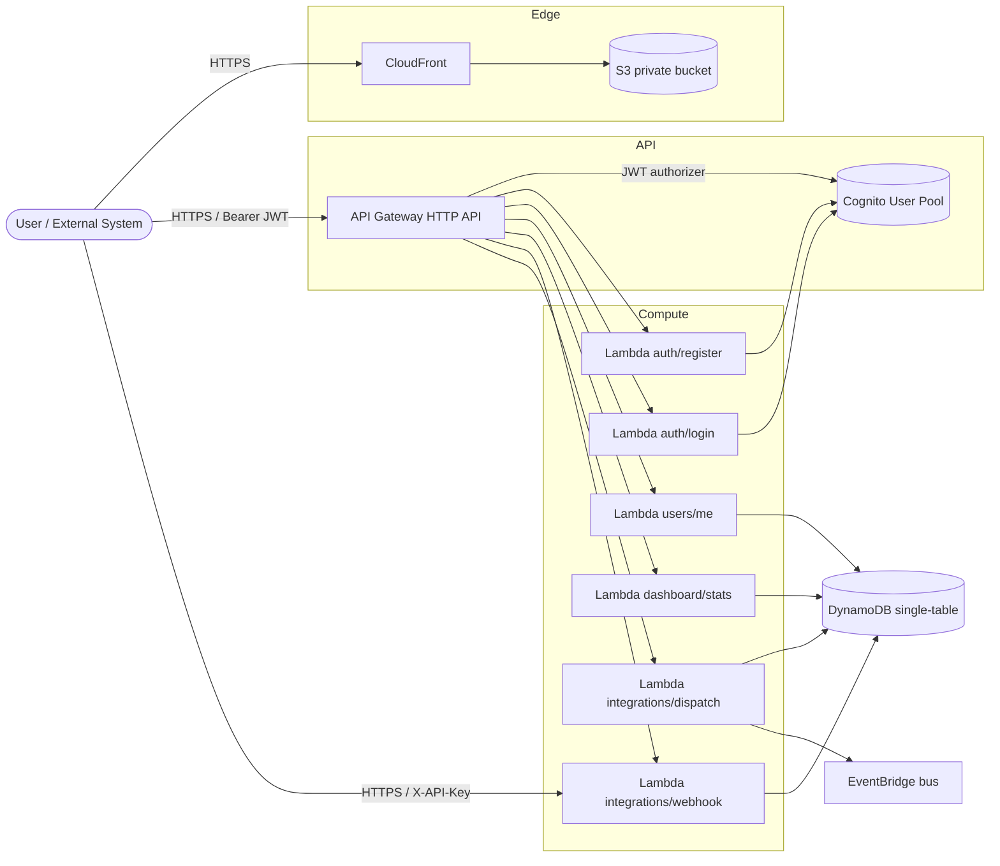
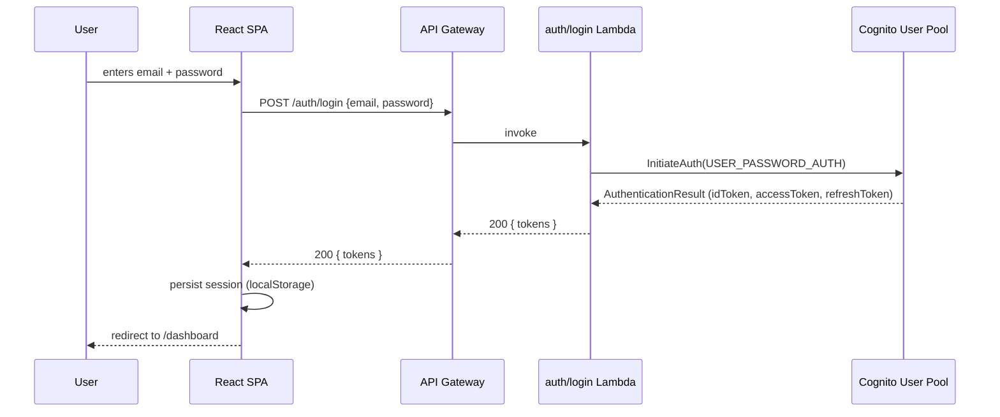
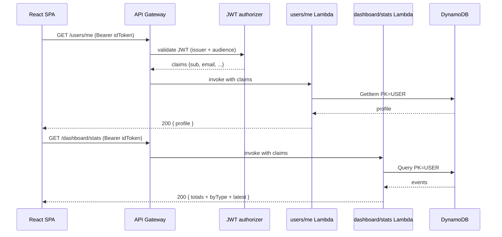
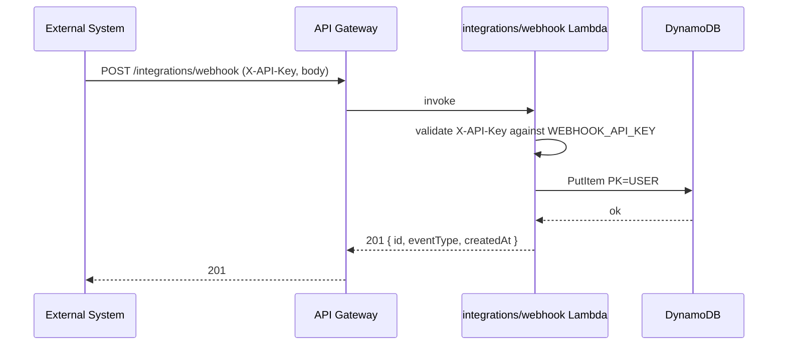
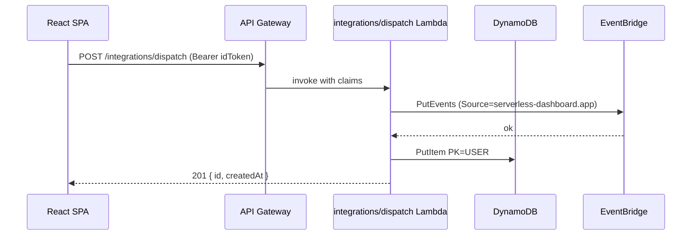

# Architecture

This document describes the cloud architecture of `serverless-dashboard-aws`,
how requests flow through the system, and the rationale behind each design
decision.

## High-level diagram


The PNG above is generated from [`architecture-diagram.py`](./architecture-diagram.py)
using the `diagrams` Python library. To regenerate it:

```bash
cd docs
pip install diagrams
python architecture-diagram.py
```

## Components

| Component | Purpose |
|---|---|
| **CloudFront** | Edge cache and HTTPS for the SPA |
| **S3 (private)** | Static hosting for the React build, accessed only via CloudFront OAC |
| **API Gateway HTTP API** | Public REST endpoint, JWT authorizer for protected routes, CORS |
| **Cognito User Pool** | Identity provider; signs JWTs validated by the authorizer |
| **AWS Lambda (Python 3.12)** | All compute. One handler per route, packaged together but routed individually |
| **DynamoDB (single-table)** | Profile + event storage; pay-per-request, point-in-time recovery enabled |
| **EventBridge custom bus** | Fan-out target for outbound integrations (`/integrations/dispatch`) |

## Component diagram (Mermaid)



## Sequence — Login



## Sequence — Authenticated dashboard load



## Sequence — Inbound webhook (system integration)



## Sequence — Outbound dispatch (fan-out)



## DynamoDB single-table design

| PK | SK | type | Notes |
|---|---|---|---|
| `USER#<sub>` | `PROFILE` | `USER_PROFILE` | One row per Cognito user |
| `USER#<sub>` | `EVENT#<iso-ts>` | `EVENT` | Tracking events per user, sorted desc |

`GSI1` is reserved for cross-user listings. Events use
`GSI1PK = "EVENT_TYPE#<type>"` so future dashboards can aggregate without scans.

## Security

- All routes except `/auth/*` and `/integrations/webhook` require a Cognito-issued JWT.
- `/integrations/webhook` is gated by a shared `X-API-Key` provided in the `WEBHOOK_API_KEY` env var (rotate it per environment).
- S3 bucket is **private**; access goes through CloudFront with **Origin Access Control (OAC)**.
- Lambdas use an IAM role with **least-privilege** statements scoped to the deployed table, user pool and event bus.
- DynamoDB has Point-in-Time Recovery enabled.

## Cost considerations

- Lambda + HTTP API + DynamoDB + Cognito + S3 + CloudFront are all pay-per-use.
- Idle cost is essentially zero outside of CloudFront and S3 storage.
